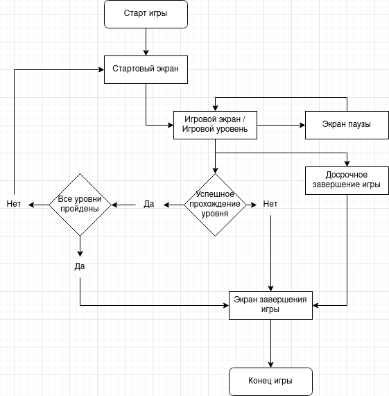
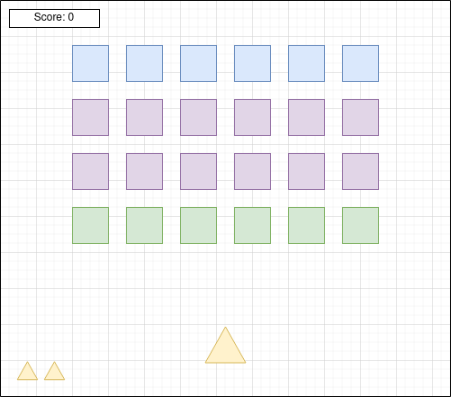
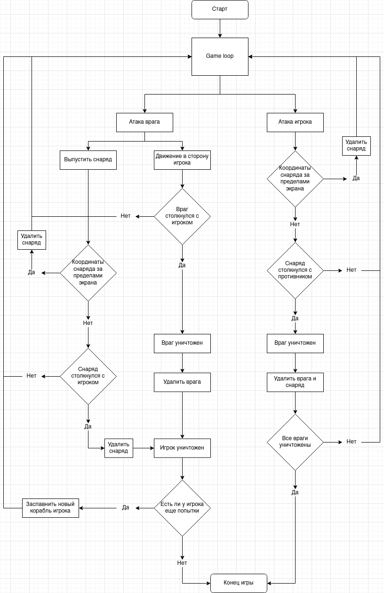

# 👾 Design document

**Galaga** - это ретро-аркадный шутер, вдохновленный классическими аркадными играми Galaxian (1979) и Galaga (1981). Игрок управляет космическим кораблем, который перемещается по бескрайнему космосу и должен защищаться от атак враждебных инопланетян. Враги появляются в рое и стремятся уничтожить корабль игрока. С каждым новым уровнем враги становятся более агрессивными и сильными. По накоплению определенного количества очков игрок может получить дополнительный бонус для улучшения корабля.

**Цель игры** - накопить как можно больше очков уничтожая корабли противника.

## Основные сцены

1. **Начальный экран.** Ожидает нажатия кнопки для старта игры. Также при успешном завершении уровня новый уровень начинается с начального экрана.
2. **Игровой экран.** Можно как перейти на экран паузы, так и досрочно завершить игру. При успешном прохождении уровня просходит переход на новый уровень.
3. **Экран паузы.**
4. **Экран завершения игры.** Отображается номер уровня и конечный счет игрока. Так же есть возможность рестарта игры.

## Пример игрового экрана

## Игрок

Игра предназначена для одного игрока. Управление осуществляется с помощью клавиатуры. По нажатию кнопки корабль игрока выпускает снаряд перед собой, который сталкиваясь с противником уничтожает его.

На старте игры у игрока есть две дополнительные попытки, максимальное количество попыток 3. Попадание снаряда противника или столкновение с ним наносит критический урон кораблю игрока.

## Элементы UI

* Левый верхний угол счет игрока
* Левый нижний угол количество оставшихся попыток
* Правый верхний угол элементы управления для паузы и досрочного прекращения игры
* Правый нижний угол текущий уровень

## Игровой уровень

Может быть различная конфигурация расположения врагов, однако должно быть не менее 3 рядов по 6 противников в каждом.

Рой врагов движется горизонтально, меняя направление после достижения края экрана.

## Виды врагов

|Тип врага|Расположение|Движение|Стрельба|Прочность|
|---------|------------|--------|--------|---------|
|1        |Первая линяя|Да      |Да      |1        |
|2        |Не первая и не последняя|Нет|Нет|1      |
|3        |Последняя линяя|Нет  |Да      |2        |  

### Свойства

* Движение - способность перемещаться вперед в направлении игрока
* Стрельба - возможность атаковать, но для последней линии необходимо, чтобы перед ними не было союзных караблей.
* Прочность - количество необходимых попаданий для уничтожения врага.
* Снаряд врага проходит через союзников не нанося им никакого урона

## Награды

> Примерный баланс игры

|Тип врага|Количество очков|
|-- |-- |
| 1 | 200 |
| 2 | 100 |
| 3 | 500 |

|Уровень|Множитель очков|
|--|--|
| 1 | 1x |
| 2-3 | 2x |
| >3| 5x |

## Улучшения

* Каждые 5000 очков игрок получает дополнительную попытку, если у игрока уже есть три дополнительные попытки, вместо нее он получает 500 очков.

## Сценарий игры

## На случай если будет время

* Добавить тип врага астеройд который движется через экран по оси Y при столкновении с которым игрок получает критический урон
* Реализовать бонусный уровень на котором за отведенное время необходимо уничтожить наибольшее количество врагов
* Добавить новые виды улучшений для корабля игрока, например, изменяющие вид атаки и т.д.
